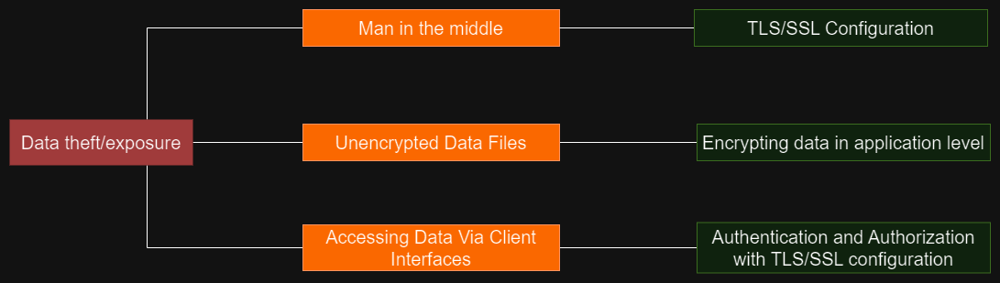

# Cassandra Security Considerations

Cassandra, out of the box, does not provide any security settings. Therefore, the basic Cassandra settings expose the platform to potential attacks, putting data at significant risk of exposure. It is advised to carefully define security measures when planning to store critical data.

Without proper settings, malicious users can easily:

- Craft internode messages to insert users into the authentication schema
- Craft internode messages to truncate or drop the schema
- Use tools such as sstableloader to overwrite system_auth tables[[1.1]](https://cassandra.apache.org/doc/stable/cassandra/operating/security.html)
- Attach to the cluster directly to capture write traffic

## Security Components in Cassandra

There are three main components to the security features provided by Cassandra:

1. TLS/SSL encryption for client and inter-node communication
2. Client authentication
3. Authorization

All these settings are configured in the `cassandra.yaml` file, where the settings to be enabled and their properties are defined. A detailed description and the method of configuring these precautions can be found in Cassandra's documentation, specifically in the "Cassandra Security" section[[1.1]](https://cassandra.apache.org/doc/stable/cassandra/operating/security.html).

The most common attacks and issues that occur in Cassandra databases include:

- Data theft
- Execution of arbitrary commands
- Denial of Service (DOS)


## Data theft attack graph



**Data Theft in Cassandra Databases:**

**What is Data Theft:**

Data theft in Cassandra databases refers to the unauthorized access, acquisition, or copying of sensitive information stored in the database. Attackers aim to exploit vulnerabilities in various aspects of the system to gain access to confidential data, compromising the integrity and confidentiality of the information.

**Causes and Prevention:**

1. **Man-in-the-Middle (MitM) Attacks:**
   - **Cause:** A Man-in-the-Middle (MitM) attack is a type of cyber attack where an unauthorized third party intercepts and potentially alters the communication between two parties without their knowledge. In this type of attack, the attacker positions themselves between the communicating parties, allowing them to listen on, manipulate or impersonate the communication. This can lead to the theft of sensitive data in cassandra databases during transit.
   - **Prevention:** Implementing TLS/SSL configuration ensures secure communication channels. This encryption helps protect data during transmission, making it challenging for attackers to intercept or manipulate information. You can achieve that in Cassandra by generating SSL certificate and configure cassandra.yml to ensure usage of it for in-out and Node-to-Node communication.

2. **Unencrypted Data Files:**
   - **Cause:** Cassandra by default does not implement any kind of file encryption. This means if someone gets to data can read it straight away.
   - **Prevention:** Encrypting data at the application level ensures that even if unauthorized access to data files occurs, the information remains encrypted and unreadable. This adds an additional layer of protection beyond database-level encryption.

3. **Client Interfaces Vulnerabilities:**
   - **Cause:** Weaknesses in client interfaces or APIs can be exploited by attackers to gain unauthorized access to the database, potentially leading to data theft.
   - **Prevention:** Implementing strong authentication and authorization mechanisms for client interfaces is crucial. Only authorized and authenticated users should have access to sensitive data. One solution is to disable all access from client interfaces.

**Preventive Measures in Detail:**

1. **Good TLS/SSL Configuration:**
   - Use the latest TLS/SSL protocols to secure data in transit.
   - Ensure proper certificate management, including valid certificates from trusted authorities.
   - Employ strong cipher suites and key exchange mechanisms.
   - Regularly update and patch TLS/SSL libraries to address vulnerabilities.

2. **Encrypting Data at the Application Level:**
   - Implement encryption algorithms within the application to protect sensitive data.
   - Use strong and well-established encryption standards.
   - Manage encryption keys securely, employing key management best practices.
   - Regularly audit and update encryption mechanisms to adapt to evolving security standards.

3. **Authentication and Authorization:**
   - Enforce multi-factor authentication for users accessing the database.
   - Implement role-based access control (RBAC) to ensure that users have the minimum necessary privileges.
   - Regularly review and update access controls based on the principle of least privilege.
   - Monitor and log access attempts to detect and respond to suspicious activities promptly.

## Execution of arbitrary commands attack graph


**What are arbitrary commands execution attacks:**

Arbitrary command execution attacks, often referred to as command injection attacks, occur when an attacker is able to execute arbitrary system commands on a target system. This type of attack typically takes advantage of insecure data handling practices, allowing an attacker to inject malicious commands that are then executed by the system. The consequences of arbitrary command execution can range from unauthorized access and data theft to complete compromise of the targeted system.

If certain configurations in Cassandra are set in a way that allows the execution of user defined functions, an attacker could potentially exploit these settings to perform malicious actions on the database. Configuration settings that lead to this security hole.

**Configuration Settings:**
```yaml
enable_user_defined_function: true
enable_script_user_defined_functions: true
enable_user_defined_threads: false
```

**Attack Scenario:**

1. **User-Defined Functions (UDFs):**
   - **enable_user_defined_function: true:** Enabling user-defined functions allows users to create their own functions in Cassandra.
   - **enable_script_user_defined_functions: true:** Enabling script-based UDFs allows users to define functions using scripting languages.

2. **User-Defined Threads:**
   - **enable_user_defined_threads: false:** Disabling user-defined threads prevents users from creating their own threads, which is a security measure.

3. **Bad Authorization:**
   - If the authorization settings are insecure or misconfigured (e.g., weak passwords, overly permissive roles), an attacker could gain unauthorized access to the system.

**Exploitation:**

An attacker could leverage these settings to create and execute malicious user-defined functions, potentially leading to arbitrary command execution. If the authorization is poorly configured, the attacker may gain unauthorized access to execute these functions.

**Prevention:**

1. **Correct Configuration:**
   - **enable_user_defined_function: false:** Disable user-defined functions if they are not required.
   - **enable_script_user_defined_functions: false:** Avoid enabling script-based UDFs, as they introduce security risks.
   - **enable_user_defined_threads: false:** Keep user-defined threads disabled for added security.

2. **Good Authorization:**
   - Ensure that authentication and authorization settings are properly configured.
   - Use strong, unique passwords for all user accounts.

By following these prevention measures, you can significantly reduce the risk of arbitrary commands execution attacks.

## Denial of Service attack graph


**Denial of Service (DoS) Attack in Cassandra:**

**What is Denial of Service(DoS) attack:**
A Denial of Service (DoS) attack is a malicious attempt to disrupt the normal functioning of a system, network, or service, making it temporarily or indefinitely unavailable to users. The goal of a DoS attack is to overwhelm the target with a flood of traffic, exhaust its resources, making it incapable of providing services to legitimate users.

**DoS in Cassandra - Database IP Address Exposure:**
If an attacker gains access to the Cassandra database's IP address, they can launch a DoS attack by flooding the database with a massive volume of requests or by exploiting vulnerabilities to consume its resources.

**Attack Techniques:**
- **Network Layer Attacks:** Flood the database server with a high volume of traffic, such as through a Distributed Denial of Service (DDoS) attack.
- **Resource Exhaustion:** Exploiting weaknesses in Cassandra's configuration or implementation to exhaust system resources, making the database unresponsive.

**Mitigations for DoS Attacks in Cassandra:**
- **Connection Limits and Timeouts:**
     - **Setting Connection Limits:** Implementing controls to limit the number of concurrent connections from a single source, preventing an attacker from overwhelming the system.
     - **Timeout Configurations:** Configuring timeouts for database connections to limit the duration of each connection, preventing long resource consumption.

- **Listening IP Addresses:**
     - **IP Whitelisting:** Restricting database access to a predefined list of trusted IP addresses, reducing the attack surface and preventing unauthorized connections.

- **Hiding Database IP Address:**
     - **Network Segmentation:** Placing the database server behind a network firewall.
    Cassandra's security documentation states that you should never publicly expose you DB IP address and that is this common issue for cassandra databases. 


References:
- [1.1 Cassandra Security documentation](https://cassandra.apache.org/doc/stable/cassandra/operating/security.html)
- [CVE Details](https://www.cvedetails.com)
- [Snyk](https://security.snyk.io/)