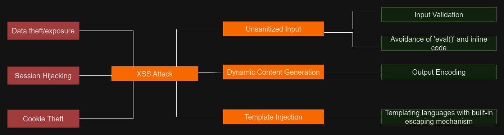
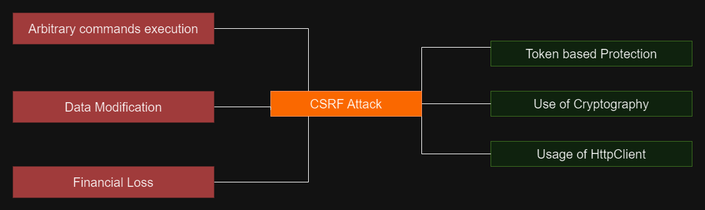
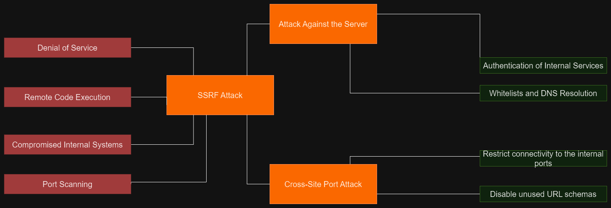

# Angular Framework and Security

Angular 2, more commonly known simply as Angular, is a single-page TypeScript framework developed by Google. It follows a component-based architecture, making it a powerful and feature-rich tool. Only recently has the security of client-side frontend layers started to gain importance.

OWASP (Open Web Application Security Project) has presented a list of the top 10 threats for web applications in 2021[[4.1]](https://owasp.org/www-project-top-ten/).

A comprehensive set of preventive measures was published by OWASP that should prevent these attacks from happening[[4.3]](https://community.f5.com/t5/technical-articles/mitigating-owasp-web-application-security-top-10-2021-risks/ta-p/311403):

1. Define security requirements.
2. Leverage security frameworks and libraries.
3. Secure database access.
4. Encode and escape data.
5. Validate all inputs.
6. Implement digital identity.
7. Enforce access controls.
8. Protect data everywhere.
9. Implement security logging and monitoring.
10. Handle all errors and exceptions.

## Angular Security

Angular is a relatively secure layer in systems, as long as the recommendations provided by the Angular security team are followed. These include using the latest version, avoiding modifications to the core Angular, and refraining from using libraries marked as insecure[[4.2]](https://angular.io/guide/security).

## XSS Attack

**Title: Understanding and Mitigating XSS Attacks in Angular Projects**

**Introduction:**

Cross-Site Scripting (XSS) attacks pose a significant threat to web applications, including those built with Angular. XSS is not only about stealing data but has evolved to encompass injecting malicious content[[4.7]](https://cheatsheetseries.owasp.org/cheatsheets/Cross_Site_Scripting_Prevention_Cheat_Sheet.html). The repercussions of XSS attacks include account impersonation, data theft, session hijacking, and cookie theft. This essay explores the causes of XSS attacks, focusing on unsanitized input, dynamic content generation, and template injection, while providing mitigation strategies based on the OWASP Cross Site Scripting Prevention Cheat Sheet[[4.7]](https://cheatsheetseries.owasp.org/cheatsheets/Cross_Site_Scripting_Prevention_Cheat_Sheet.html).

**Causes of XSS Attacks:**

1. **Unsanitized Input:**
   - **Description:** All user inputs should be treated as potentially malicious. Failure to sanitize user inputs allows attackers to inject scripts that can later execute when viewed by other users.
   - **Mitigation:** Implement strict input validation and sanitize user inputs before rendering them in the application. Angular's built-in mechanisms for input validation can help achieve this.

2. **Dynamic Content Generation:**
   - **Description:** Generating dynamic content without proper encoding or escaping leaves room for attackers to inject malicious scripts.
   - **Mitigation:** To enhance security in Angular, it is crucial to utilize the built-in templating system, which automatically escapes dynamic content, preventing the execution of potentially harmful scripts. Developers should refrain from employing methods like `dangerouslySetInnerHTML` in Angular, as they can introduce vulnerabilities by allowing unescaped content to be rendered in the application, increasing the risk of cross-site scripting attacks.

3. **Template Injection:**
   - **Description:** Improper handling of templates can lead to injection vulnerabilities, enabling attackers to execute arbitrary code.
   - **Mitigation:** Strict input validation is imperative. Ensuring that all user inputs undergo thorough validation on the server-side before rendering in the application. Second, leveraging Angular's built-in contextual escaping mechanisms, such as the {{ variable | pipe }} syntax. Contextual escaping ensures that data is appropriately rendered in the intended context, preventing the inadvertent execution of scripts. Third, adopting a Content Security Policy (CSP) serves as a robust defense mechanism. By implementing and enforcing CSP headers on the server, developers can control and restrict the types of content the application is allowed to load, thereby mitigating the impact of template injection attacks.

**XSS Defense Philosophy:**

To achieve perfect injection resistance, every variable in a web application must go through validation and be properly escaped or sanitized. While frameworks streamline this process, developers should be aware of security gaps and use output encoding and HTML sanitization when needed.

**Output Encoding:**

Output encoding is a fundamental defense against XSS. It involves converting untrusted input into a safe form, preventing it from being executed as code. Different contexts require specific encoding methods:

1. **HTML Contexts:**

   - Use HTML entity encoding (`&lt;`, `&gt;`, etc.) to safely insert variables between HTML tags.

2. **HTML Attribute Contexts:**

   - Apply HTML attribute encoding to variables placed in HTML attribute values. Use quotation marks to prevent context changes.

3. **JavaScript Contexts:**

   - Place variables in JavaScript only within "quoted data values" to ensure safety. Use proper encoding methods, such as `\xHH` format.

4. **CSS Contexts:**

   - Variables should be placed only in CSS property values. Use style.property or CSS encoding methods for safety.

5. **URL Contexts:**
   - Use URL encoding for variables placed in URLs. Be cautious about different contexts where URLs are used.

**HTML Sanitization:**

When users author HTML content, output encoding alone may break intended functionality. HTML sanitization, using tools like DOMPurify, helps strip dangerous HTML, providing a safe HTML string.

**Conclusion:**

XSS attacks remain a persistent threat, but with a combination of secure coding practices, output encoding, HTML sanitization, and awareness of framework security features, developers can significantly reduce the risk of XSS vulnerabilities in Angular projects.

## Cross-Site Request Forgery(CSRF):

**Cross-Site Request Forgery (CSRF) in Angular: Causes and Mitigations**

Cross-Site Request Forgery (CSRF) is a security vulnerability that allows attackers to perform malicious actions on behalf of an authenticated user. In the context of Angular, CSRF attacks can manifest on the client side when the attacker manipulates client-side JavaScript code to send forged HTTP requests to a vulnerable target site[[4.6]](https://cheatsheetseries.owasp.org/cheatsheets/Cross-Site_Request_Forgery_Prevention_Cheat_Sheet.html). This often occurs when the JavaScript program uses attacker-controlled inputs, such as the URL, to generate asynchronous HTTP requests. The main idea behind these attacks are to execute
arbitrary commands, modificate data and produce financial loss.

**Causes of Client-Side CSRF Attacks:**
Client-side CSRF in Angular differs from classical CSRF attacks where the server-side program is the most vulnerable[[4.6]](https://cheatsheetseries.owasp.org/cheatsheets/Cross-Site_Request_Forgery_Prevention_Cheat_Sheet.html). In client-side CSRF, the JavaScript program becomes the vulnerable component. The attacker can manipulate the client-side JavaScript to generate arbitrary asynchronous requests by controlling inputs such as the request endpoint and parameters. This introduces an input validation problem and reintroduces the confused deputy flaw, making it challenging for the server-side to distinguish intentional requests from malicious ones.

**Attack Scenario:**
Attackers typically share a malicious URL with victims, who unwittingly execute actions on a vulnerable website. Alternatively, attackers can create an attack page to abuse browser APIs and trick the target page's JavaScript into sending HTTP requests. This closely resembles the attack model of classical CSRF attacks.

**Mitigations for Client-Side CSRF:**

1. **Token Based Authentication:** Generating secure tokens for communication and validate them on sides. Utilize cryptography to enhance the integrity and confidentiality of these tokens.

2. **Independent Requests:** Prevent client-side CSRF by disallowing asynchronous requests generated through attacker-controllable inputs like the URL, window name, document referrer, and postMessages.

3. **Input Validation:** Implement input validation checks to ensure a strict assessment of the format and values of request parameters. This helps prevent state-changing operations and allows only safe operations.

4. **Predefined Request Data:** Store a list of predefined, safe request data in the JavaScript code. This includes combinations of endpoints, request methods, and parameters that are safe to be replayed.

**Defense In Depth Techniques:**

1. **SameSite (Cookie Attribute):** Use SameSite cookie attribute to mitigate CSRF attacks. It defines whether cookies should be sent with cross-site requests. Values include Lax, Strict, or None.

2. **Standard Headers to Verify Origin:** Use headers like Origin or Referer to verify the source and target origins of an HTTP request. Ensure the origins match to accept legitimate requests.

3. **Cookies with Host Prefixes:** Use \_\_Host- prefixed cookies for CSRF tokens to prevent overwriting from other subdomains, ensuring a specific path, and enforcing secure transmission.

**User Interaction-Based CSRF Defense:**

While the mentioned techniques don't require user interaction, some strong CSRF defenses involve user interaction, such as re-authentication, one-time tokens, or CAPTCHA for critical operations.

**CSRF Vulnerabilities in Login Forms:**

Even in login forms, CSRF vulnerabilities can occur, allowing attackers to assume authenticated identities. Mitigate login CSRF by creating pre-sessions and including tokens in login forms.

**JavaScript Implementation for CSRF Token Inclusion:**

Automatically include CSRF tokens in AJAX request headers using the following techniques:

- **XMLHttpRequest (Native JavaScript):** Override XMLHttpRequest's open() method to add the anti-csrf-token header for state-changing methods.
- **AngularJS:** Set default headers for HTTP operations in AngularJS.
- **Axios:** Set default headers for state-changing actions in Axios.
- **JQuery:** Use $.ajaxSetup() to add the anti-csrf-token header to AJAX requests in jQuery.

These implementation examples ensure that CSRF tokens are automatically included in requests, strengthening the security of state-changing operations in Angular applications.

## SSRF Attack

**SSRF Attack in Angular:**

**Explanation:**

**Server-Side Request Forgery (SSRF)** attacks in Angular involve manipulating the server to make unintended requests to internal or external domains. In Angular applications, attackers exploit functionalities that involve importing data from a URL, publishing data to a URL, or reading data from a URL that can be manipulated[[4.4]](https://cheatsheetseries.owasp.org/cheatsheets/Server_Side_Request_Forgery_Prevention_Cheat_Sheet.html).

**Things that attackers seek to achieve via SSRF:**

1. **DDoS (Distributed Denial of Service):** Attackers can abuse SSRF to send a large volume of requests from the vulnerable server to overwhelm and disrupt external systems, leading to a denial of service.

2. **Remote Code Execution:** SSRF allows attackers to make the server connect back to itself or internal services. This can lead to the execution of arbitrary code, compromising the security and integrity of the application.

3. **Compromised Internal Systems and Port Scanning:** Attackers can leverage SSRF to access internal resources, such as cloud metadata, databases, or REST interfaces. This can result in unauthorized access, extraction of sensitive data, and even internal port scanning for identifying and exploiting unsecured services.

**Most common attacks[[4.5]](https://brightsec.com/blog/ssrf-server-side-request-forgery/):**

1. **Attack Against the Server:** Injecting SSRF payloads into parameters that accept URLs or files, attackers can access internal resources, pages, and files. For instance, by manipulating the URL, an attacker may access the /admin panel or read files from the server.

2. **Cross-Site Port Attack (XSPA):** In this type of SSRF, attackers can scan the server for open ports using the loopback interface (127.0.0.1 or localhost). This involves trying to access various ports to gather information about the server's vulnerabilities.

**Mitigations:**

1. **Authentication of Internal Services:** Ensure that authentication is enabled for all internal services running within the network. Even services that don't require authentication for normal operations should have it enabled to prevent exploitation.

2. **Whitelists and DNS Resolution:** Implement whitelists for approved domains and addresses that the application can access. Strictly control DNS resolution to trusted and intended domain names, preventing unauthorized access.

3. **Restricting Connectivity to Internal Ports:** Limit access to internal ports, preventing SSRF attacks from exploiting services on those ports. This helps in controlling and securing communication within the internal network.

4. **Disabling Unused URL Schemas:** Allow only the URL schemas that the application uses. Disable unnecessary schemas like ftp, file, etc., if they are not required for the application's functionality. This reduces the attack surface and minimizes the risk of SSRF.

By implementing these preventive measures, Angular applications can enhance their resilience against SSRF attacks, protecting sensitive data, internal systems, and ensuring the overall security of the application.

References:

- [4.1 OWSAP Top 10 Web Application Security Risks](https://owasp.org/www-project-top-ten/)
- [4.2 Angular Security](https://angular.io/guide/security)
- [4.3 OWSAP Prevention measures](https://community.f5.com/t5/technical-articles/mitigating-owasp-web-application-security-top-10-2021-risks/ta-p/311403)
- [4.4 OWSAP SSRF Prevention Cheat Sheet](https://cheatsheetseries.owasp.org/cheatsheets/Server_Side_Request_Forgery_Prevention_Cheat_Sheet.html)
- [4.5 Bright-SSRF Attacks](https://brightsec.com/blog/ssrf-server-side-request-forgery/)
- [4.6 OWSAP CSRF Prevention Cheat Sheet](https://cheatsheetseries.owasp.org/cheatsheets/Cross-Site_Request_Forgery_Prevention_Cheat_Sheet.html)
- [4.7 OWSAP XSS Prevention Cheat Sheet](https://cheatsheetseries.owasp.org/cheatsheets/Cross_Site_Scripting_Prevention_Cheat_Sheet.html)