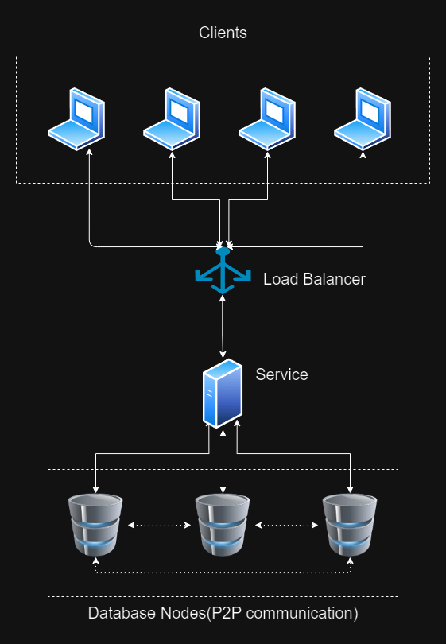

# ZOSS-Tim 5

  - Bane Geric, R2-32/2023
  - Dragan Mirkovic, R2-27/2023

# Project Overview

This project aims to illustrate a complex system and its layers. It will showcase each module, representing a technology, along with its strengths, weaknesses, and security aspects. For each module, the most common security attacks, potential solutions, and security issues they introduce will be presented.

# Project Structure

The main readme file will explain the architecture and technologies used, along with their explanations. The project will be organized with a folder structure where each folder corresponds to a unit in the system. Additionally, there will be two folders: [**Resources**](https://github.com/Dragan2402/zoss-23-24/tree/main/Resources) and [**Other**](https://github.com/Dragan2402/zoss-23-24/tree/main/Other). The [**Resources**](https://github.com/Dragan2402/zoss-23-24/tree/main/Resources) folder represents external sources used in the development of this solution, while the [**Other**](https://github.com/Dragan2402/zoss-23-24/tree/main/Other) folder will contain interesting facts, articles recommended for reading to expand knowledge, and other miscellaneous items.

## Architecture

The architecture consists of four layers:
1. [**Database Layer** - Cassandra NoSQL database](https://github.com/Dragan2402/zoss-23-24/tree/main/1.%20Database%20layer)
2. [**Service Layer** - Django application](https://github.com/Dragan2402/zoss-23-24/tree/main/2.%20Service%20layer)
3. [**Load Balancer** - Nginx](https://github.com/Dragan2402/zoss-23-24/tree/main/3.%20Load%20balancer%20layer)
4. [**Client Layer** - Angular application](https://github.com/Dragan2402/zoss-23-24/tree/main/4.%20Client%20layer)

## Brief Description of Technologies:

### [1. Cassandra](https://github.com/Dragan2402/zoss-23-24/tree/main/1.%20Database%20layer)

Cassandra is an open-source NoSQL distributed database that manages large amounts of data across commodity servers. It is a decentralized, scalable storage system designed to handle vast volumes of data across multiple commodity servers, providing high availability without a single point of failure[[1]](https://cassandra.apache.org/doc/latest/index.html).

### [2. Flask](https://github.com/Dragan2402/zoss-23-24/tree/main/2.%20Service%20layer)

Flask is micro-framework used for creating web applications, that provides a solid core with the basic services, while extensions provide the rest. It contains two main dependencies. The routing, debugging, and Web Server Gateway Interface (WSGI) subsystems come from Werkzeug, while template support is provided by Jinja2 [[4]](https://coddyschool.com/upload/Flask_Web_Development_Developing.pdf).

### [3. Nginx](https://github.com/Dragan2402/zoss-23-24/tree/main/3.%20Load%20balancer%20layer)

NGINX is open source software for web serving, reverse proxying, caching, load balancing, media streaming, and more. It started out as a web server designed for maximum performance and stability. In addition to its HTTP server capabilities, NGINX can also function as a proxy server for email (IMAP, POP3, and SMTP) and a reverse proxy and load balancer for HTTP, TCP, and UDP servers [[3]](https://www.nginx.com/resources/glossary/nginx/).

### [4. Angular](https://github.com/Dragan2402/zoss-23-24/tree/main/4.%20Client%20layer)

Angular is a development platform, built on TypeScript[[2]](https://angular.io/docs). As a platform, Angular includes:
- A component-based framework for building scalable web applications
- A collection of well-integrated libraries covering various features, including routing, forms management, client-server communication, and more
- A suite of developer tools to aid in code development, building, testing, and updating

Detailed information on security and attacks will be explained for each technology in their respective dedicated chapters.

References: 
- [1. Cassandra documentation](https://cassandra.apache.org/doc/latest/index.html)
- [2. Angular documentation](https://angular.io/docs)
- [3. Nginx documentation](https://www.nginx.com/resources/glossary/nginx/)
- [4. Flask Web Development](https://coddyschool.com/upload/Flask_Web_Development_Developing.pdf)
